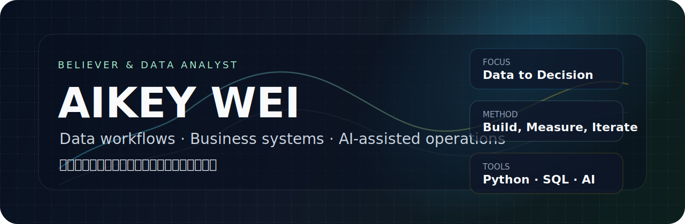

<div align="center">
  
</div>

<br />

<div align="center">

[](https://github.com/aikeywei)


</div>

## About

Hi, I am **Aikey Wei**.

I work at the intersection of **data analysis, business process design, and AI-assisted systems**. My interest is turning fragmented information into tools, dashboards, and repeatable workflows that make decisions easier to review and improve.

我更关注“能真正落地的系统”：从业务问题出发，整理数据口径，建立指标逻辑，再把它变成可以复用、可以追踪、可以持续迭代的工具。

## Current Focus

- Building practical data workflows with Python, SQL, Excel, and lightweight web tools.
- Designing business systems around traceability, reporting, cost, profit, and process control.
- Exploring AI-assisted research, documentation, automation, and personal knowledge workflows.
- Turning complex work into clean structures: metrics, dashboards, operating playbooks, and review loops.

## Selected Work

| Project | What it reflects | Stack / Direction |
| --- | --- | --- |
| [Sigma_04LabFlowERP](https://github.com/aikeywei/Sigma_04LabFlowERP) | A business management loop for lab testing orders, revenue, costs, profit accounting, reports, permissions, and future integrations. | ERP thinking, process design, reporting |
| [trading-system](https://github.com/aikeywei/trading-system) | A personal research and review system around trading, knowledge assets, practice records, and output. | Python, research workflow, knowledge base |
| [trendboard-pages](https://github.com/aikeywei/trendboard-pages) | A lightweight browser page used for presenting and organizing information visually. | HTML, visual page, prototype |

## How I Work

```text
Business question -> Data structure -> Metric logic -> Working tool -> Review loop
```

I like systems that are:

- **Clear**: every metric has a source, definition, and owner.
- **Traceable**: results can be checked back to original records.
- **Practical**: tools should reduce repeated work, not add decoration.
- **Iterative**: a first usable version is better than a perfect plan that never ships.

## Toolbox

<div>
  
  
  
  
  
  
  
  
</div>

## GitHub Snapshot

<div align="center">
  
  
</div>

## Notes

I use GitHub as a place to structure work, test ideas, and document systems. Some repositories are experiments, some are working notes, and some are gradually becoming reusable products.

> Believer & Data Analyst.

