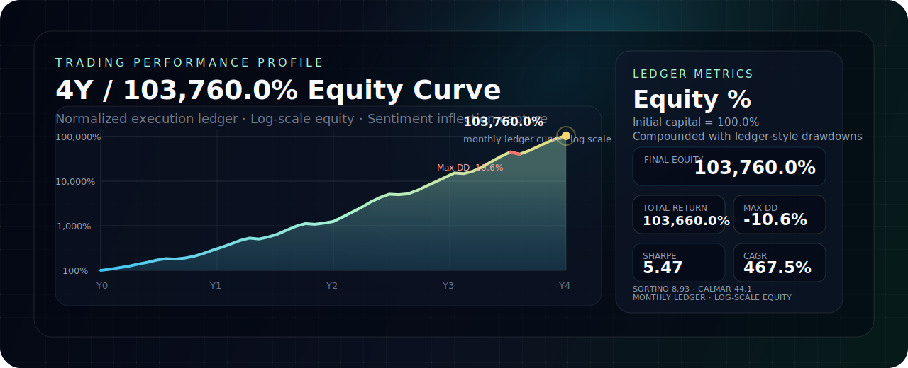

<div align="center">
  
</div>

<br />

<div align="center">


</div>

## Profile

I build at the intersection of **faith, markets, and AI architecture**.

My work is shaped by conviction, structured reasoning, and a strong bias toward systems that can be tested, repeated, and scaled. I think in signals, turning points, operating loops, and intelligent tools - whether the arena is a market chart, a business workflow, or an AI-native product.

## Identity Stack

| Identity | Description |
| --- | --- |
| **Believer** | Raised in a Christian family and baptized at 18. |
| **Trader** | 4-year / 1000x+ return record; market-first, sentiment-driven, and focused on capturing inflection points. |
| **AI Architect** | Builder of AI-assisted systems for stock selection, laboratory operations, content infrastructure, dashboards, and decision workflows. |

## Believer

Raised in a Christian family and baptized at 18.

## Trader

My trading framework is built around the market itself.

I do not start from fundamental narratives. I start from price action, liquidity, sentiment pressure, crowd positioning, and the moments where the market begins to reveal a shift before the story becomes obvious.

- **Performance**: 4-year / 1000x+ return record.
- **Mode**: market-first trading.
- **Core lens**: sentiment games, emotional compression, and behavioral asymmetry.
- **Primary edge**: identifying nodes, turning points, and high-conviction inflection windows.

<div align="center">
  
</div>

## AI Architect

I use AI as an architecture layer, not just a productivity tool.

My focus is to design systems where data, workflow, reasoning, and automation reinforce each other: dashboards that surface signal, ERP logic that controls operations, research systems that compound knowledge, and AI agents that reduce repeated cognitive work.

| System | Direction |
| --- | --- |
| **Stock Selection System** | Signal extraction, screening logic, market structure analysis, and decision support for trading research. |
| [**Laboratory ERP System**](https://github.com/aikeywei/Sigma_04LabFlowERP) | Order flow, revenue, cost, profit, permission control, reporting, and operational visibility. |
| **Sigma Blog** | Structured publishing, research output, knowledge infrastructure, and AI-assisted content operations. |

## Analytical Foundation

My technical foundation comes from mathematics, with a specialization in **Applied Statistics**.

That background gives my AI and trading work a sharper analytical base: probability, inference, variance, correlation, sampling, signal detection, anomaly analysis, KPI design, forecasting, and decision making under uncertainty.

I am especially strong at:

- turning messy business problems into measurable analytical frameworks;
- designing KPI systems and executive dashboards;
- diagnosing revenue, cost, profit, and operational performance;
- finding signal in noisy time series, cohorts, funnels, and behavioral data;
- rebuilding spreadsheet logic into structured systems;
- connecting data analysis with AI automation and productized workflows.

## Selected Repositories

| Repository | Signal |
| --- | --- |
| [Sigma_04LabFlowERP](https://github.com/aikeywei/Sigma_04LabFlowERP) | ERP architecture, business process modeling, profit logic, reporting, and permission design. |
| [trading-system](https://github.com/aikeywei/trading-system) | Trading research, market review, practice records, and knowledge structure. |
| [trendboard-pages](https://github.com/aikeywei/trendboard-pages) | Visual presentation, information organization, and lightweight web prototyping. |

## Operating Philosophy

```text
Conviction -> Signal -> Structure -> System -> Execution
```

The edge is not a single skill. It is the integration of belief, market judgment, statistical thinking, and AI-native system design.

**Believer. Trader. AI Architect.**
